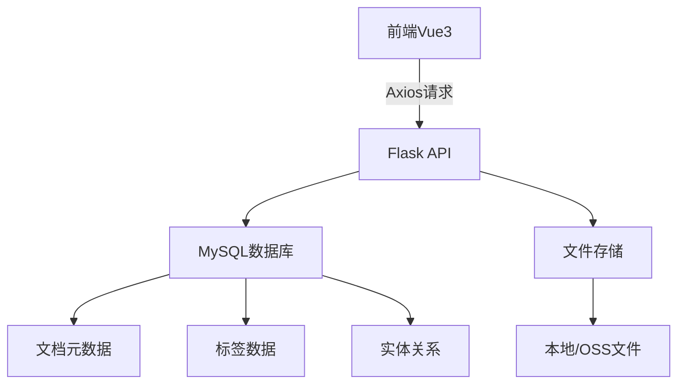

# 个人知识管理系统

## 预想功能

- 文档上传
- 登录/注册
- 基础文档管理
- 标签系统
- 全文搜索
- 知识图谱

## 技术架构




## 数据库设计

### 用户表(users)

存储用户的基本信息,由于身份认证

```sql
CREATE TABLE users (
    id INT PRIMARY KEY AUTO_INCREMENT,
    email VARCHAR(100) UNIQUE,
    password VARCHAR(128) NOT NULL,
    created_at TIMESTAMP DEFAULT CURRENT_TIMESTAMP,
    login_ts TIMESTAMP DEFAULT CURRENT_TIMESTAMP
);
```

- **id**：主键，唯一标识用户，自增整数。
- **email**：用户的邮箱地址，唯一且可选，可用于找回密码。
- **password_hash**：加密后的密码哈希值（如使用 bcrypt 或 Argon2），确保密码安全。
- **created_at**：用户注册时间，默认当前时间戳，便于后续分析用户行为。
- **login_ts**: 用户登录的时间,默认当前时间戳,便于后续验证用户的登录状态

### 文档表(documents)

储存用户上传的文档元数据和内容,支持文档管理和搜索功能

```sql
CREATE TABLE documents (
    id INT PRIMARY KEY AUTO_INCREMENT,
    title VARCHAR(200) NOT NULL,
    content TEXT,
    file_path VARCHAR(500) NOT NULL,  -- 文件存储路径
    file_tag VARCHAR(10) NOT NULL,   -- pdf/docx/txt等
    user_id INT NOT NULL,
    upload_time TIMESTAMP DEFAULT CURRENT_TIMESTAMP,
    FULLTEXT INDEX ft_content (title, content),
    FOREIGN KEY (user_id) REFERENCES users(id)
);
```

- **id**：主键，唯一标识文档，自增整数。
- **title**：文档标题，用于显示和搜索。
- **content**：文档的纯文本内容（通过解析 PDF/Word 等文件提取），支持全文搜索。
- **file_path**：文件在服务器或云存储（如 MinIO）中的路径，如 `/uploads/2023/report.pdf`。
- **file_type**：文件扩展名（如 `pdf`、`docx`），用于前端图标展示和格式处理。
- **user_id**：外键关联 `users.id`，标识文档所属用户。
- **upload_time**：文档上传时间，默认当前时间戳，用于排序和筛选。

**索引与外键**：

- **FULLTEXT(title, content)**：对标题和内容建立全文索引，加速关键词搜索。
- **FOREIGN KEY (user_id)**：确保每个文档关联到有效用户。

### 标签表(tags)

管理用户自定义的标签，用于分类和快速筛选文档。

```sql
CREATE TABLE tags (
    id INT PRIMARY KEY AUTO_INCREMENT,
    name VARCHAR(50) NOT NULL,
    user_id INT NOT NULL,
    FOREIGN KEY (user_id) REFERENCES users(id)
);
```

- **id**：主键，唯一标识标签，自增整数。
- **name**：标签名称（如 `技术`、`会议记录`），同一用户不可重复且不可为空。
- **user_id**：外键关联 `users.id`，标识标签的创建者，实现多用户标签隔离。

**索引与外键**：

- **UNIQUE(name)**：防止重复标签。
- **FOREIGN KEY (created_by)**：确保标签归属有效用户。

### 文档-标签关联表(**document_tags**)

实现文档与标签的多对多关系，允许一个文档关联多个标签，一个标签被多个文档使用。

```sql
CREATE TABLE document_tags (
    document_id INT NOT NULL,
    tag_id INT NOT NULL,
    PRIMARY KEY (document_id, tag_id),
    FOREIGN KEY (document_id) REFERENCES documents(id),
    FOREIGN KEY (tag_id) REFERENCES tags(id)
);
```

- **document_id**：外键关联 `documents.id`，标识被标记的文档。
- **tag_id**：外键关联 `tags.id`，标识关联的标签。

**索引与外键**：

- **PRIMARY KEY (document_id, tag_id)**：联合主键，确保同一文档的相同标签不重复。
- **FOREIGN KEY (document_id)**：确保关联的文档有效。
- **FOREIGN KEY (tag_id)**：确保关联的标签有效。

### 知识实体表

存储从文档内容中提取的知识实体（如人名、概念），支持知识图谱构建。

```sql
CREATE TABLE entities (
    id INT PRIMARY KEY AUTO_INCREMENT,
    name VARCHAR(100) NOT NULL,
    type ENUM('Person', 'Location', 'Concept', 'Event') NOT NULL,
    description TEXT,
    created_at DATETIME DEFAULT CURRENT_TIMESTAMP
);
```

- **id**：主键，唯一标识实体，自增整数。
- **name**：实体名称（如 `机器学习`、`北京`），不可为空。
- **type**：实体类型枚举（`Person`、`Location`、`Concept`、`Event`），用于分类和可视化。
- **description**：实体的描述文本（可选），如从文档中提取的上下文摘要。
- **created_at**：实体创建时间，默认当前时间戳。

**索引与外键**：

- **INDEX(name)**：加速按名称查询实体。

### 实体关系表

记录实体之间的关联关系（如 "属于"、"相关"），构建知识图谱的网络结构。

```sql
CREATE TABLE relationships (
    id INT PRIMARY KEY AUTO_INCREMENT,
    source_id INT NOT NULL,
    target_id INT NOT NULL,
    relation_type VARCHAR(50) NOT NULL,  -- 如"相关", "属于", "反对"
    weight FLOAT DEFAULT 1.0,
    FOREIGN KEY (source_id) REFERENCES entities(id),
    FOREIGN KEY (target_id) REFERENCES entities(id)
);
```

- **id**：主键，唯一标识关系，自增整数。
- **source_id**：外键关联 `entities.id`，表示关系的起始实体。
- **target_id**：外键关联 `entities.id`，表示关系的目标实体。
- **relation_type**：关系类型（如 `属于`、`相关`），用于可视化时显示连接标签。
- **weight**：关系权重（默认为1.0），可用于表示关联强度，支持后续推荐算法。

**索引与外键**：

- **FOREIGN KEY (source_id)**：确保起始实体有效。
- **FOREIGN KEY (target_id)**：确保目标实体有效。
- **INDEX(source_id, target_id)**：加速查询特定实体间的关系。

## 接口设计

### 文档上传


